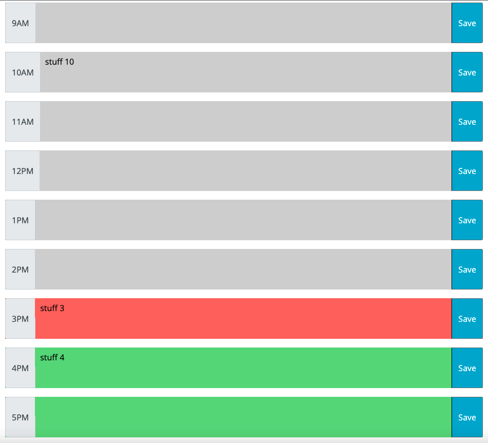

# work-day-scheduler

https://ehochw01.github.io/work-day-scheduler/

I implemented a work day scheduler that keeps track of the current hour, and stores info into local storage that the user can input. To create the rows of the hour log I used a Bootstrap group with Button addons. I ran into some limitations with this, such as not really being able to resize the input text area. I could have tried to start over using Bootstrap form rows, but I wanted to implement the minimal viable product.

Screen shots of the application:

